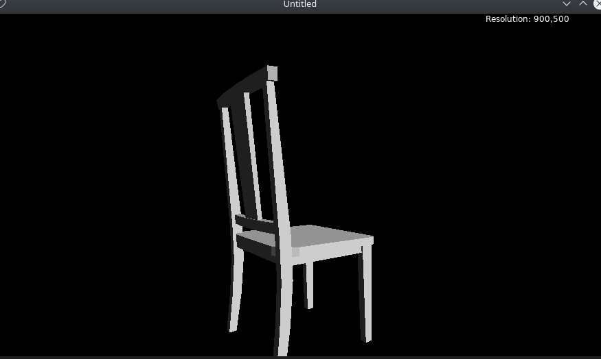
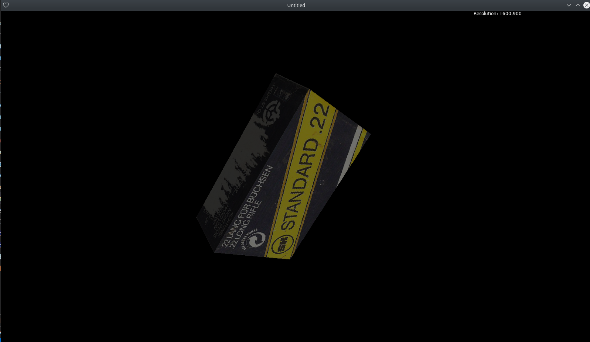

# LuaSoftwareRenderer
Make a software renderer using Lua cz I'm boring

---

This renderer uses love2d as graphic api(only for creating windows and drawing the final framebuffer). Make sure [love](https://love2d.org/wiki/Main_Page) is installed on your computer.

for Linux:

``` bash
$sudo apt install love
```

and run

```bash	
$love LuaSoftwareRenderer
```

## Screenshot







## TODO-List

- [ ] Normal Map
- [ ] Diffuse lighting
- [ ] Outline shader
- [ ] Casting shadow

